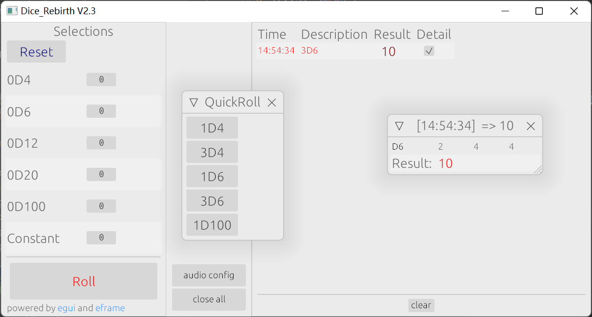

# Dice 掷骰子
一个用来方便跑团掷骰子的程序  
**仅供使用，个人开发，代码混乱，没有文档，不会维护**（应该没有大bug）
****
___
跑团的时候，需要常常掷3D6啊，1D20+3之类的骰子。本程序通过随机数生成对应的结果，还可以播放掷骰子的声音！

### 使用方法
1. 对于非常常用的骰子组合(比如3D6)，可以直接点击QuickRoll面版中的对应按钮，结果记录在右方区域的最后一行
2. 对于一般的骰子组合，可以左右拖动左侧Selections中对应的数字调节骰子的数量，然后点击Roll按钮掷骰子。点击左上角Reset按钮将骰子数量清零。
3. 右方从上到下记录了掷骰子每一次的结果，最多储存最近100条，最新的一条位于最下方且标红。单击区域下方的clear可以清理除了最新一条外的所有记录，双击清理全部记录。
4. 勾选每一条记录右边的Detail按钮，可以打开细节面版，展示本次掷骰子中每一个骰子的具体结果。可以同时开启多个。 
5. 点击中部的audio config按钮打开音量面版，可以调节声音大小，重载输出设备。

### 关于程序本身

+ 使用rust编写，使用eframe做界面，但本人其实并不真正会用rust
+ assets中的音效文件：骰子滚动音效 许可:CC0 作者:mwirth 来源:耳聆网 https://www.ear0.com/sound/15401
